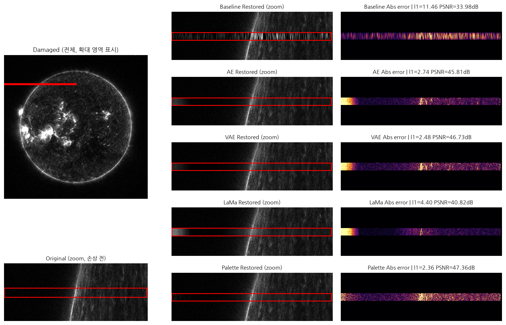

# KASI SDO MISS 영상 복원 — AI 기반 손상 진단 및 복원

한국천문연구원(KASI) 우주탐사기술센터 하계 인턴십에서 진행한 프로젝트입니다.
SDO/AIA 131Å 태양 관측 영상에 발생하는 데이터 손실(MISS) 영역을 진단하고,
5가지 방법론(Baseline, AE, VAE, LaMa, Palette)의 복원 성능을 비교 평가했습니다.

- **기간**: 2026년 여름 (약 2개월)
- **지도**: 백지혜 박사님, 조원근 박사님
- **소속**: 충남대학교 컴퓨터융합학부 3학년 최윤성

## 1. 배경

SDO는 16년간 태양을 관측해온 핵심 자산 데이터입니다.
131Å 채널을 전수 조사한 결과, 4,200만 프레임 중 약 70만 건에서 이상 신호가 발견됐으나
이 중 93.6%는 지구 식(Eclipse) 등 정상 운영 상태였고,
**실제 손상은 3개 유형 합계 44,453건**이었습니다.

## 2. 손상 유형 분류

QUALITY 헤더의 32비트 플래그를 기반으로 세 가지 손상 유형을 분류했습니다.

| 유형 | 토큰 | 건수 | 판별 방법 | 판별 정확도 |
|---|---|---|---|---|
| 픽셀(행) 손실 | Q_1_MISS0~3 | 19,002 | 결손 픽셀(NaN) 존재 유무 | 100% |
| 밝기 이상 | Q_AIA_FOOR | 13,862 | 노출시간(exptime) > 4.0초 | 100% |
| 카메라 상태 이상 | Q_CAM_ANOM1 | 11,909 | AIHIS192 2단계 판정 | 재현율 99.99% |

밝기 이상형과 카메라 상태 이상형은 **메타데이터만으로 자동 판별 가능**했으며,
실제 이미지 복원이 필요한 유형은 **픽셀 손실형(MISS)** 뿐이었습니다.

## 3. 복원 파이프라인

고전적 방법(Baseline)부터 딥러닝(AE, VAE, LaMa, Palette)까지
동일 조건에서 정량 비교했습니다.

    원본 로드 → 손상 시뮬레이션 → 패치 복원 → core-crop 병합 → 정량·정성 평가

### Baseline: Cubic → Linear 전환

넓은 손상 밴드(최대 수백~수천 px)에서 cubic spline은 값이 크게 흔들리는(overshoot)
문제가 있어, linear 보간으로 전환했습니다 (L1 기준 약 34배 개선).

### AE/VAE 구조 개선: Deep Encoder + Core-Crop

수용영역(RF ≈ 68px)이 MISS1 손상 폭(289~409px)보다 좁아 손상 영역이
단색으로 붕괴(collapse)하는 문제를 진단했습니다. 인코더를 4단계로 확장하고
dilated bottleneck을 추가해 RF를 넓혔으며, 겹치는 타일을 평균 내는 대신
각 타일의 중앙 core만 잘라 이어붙이는 core-crop 병합 방식을 도입해
경계 얼룩(banding artifact)을 제거했습니다.

### 사용 모델

- **Baseline**: 열(column) 단위 1D 선형 보간
- **AE**: 4-level encoder + dilated bottleneck convolution 기반 오토인코더
- **VAE**: AE와 동일 구조에 확률적 잠재변수(KL divergence) 추가
- **LaMa**: Fast Fourier Convolution 기반 GAN, 넓은 receptive field로 대형 손상에 강점
- **Palette**: Conditional Diffusion Model 기반 inpainting (DDPM 계열, sample_steps=200)

## 4. 정량 결과

손상 영역(masked region)만을 대상으로 200장 평균을 산출했습니다.

### MISS0 (협소 손상, missvals > 0, 평균 손상 비율 0.28%)

| 모델 | Masked L1↓ | Masked RMSE↓ | Masked PSNR(dB)↑ | Masked SSIM↑ |
|---|---|---|---|---|
| Baseline (linear) | 2.55 | 3.61 | 51.38 | 0.9679 |
| AE | 2.59 | 4.28 | 51.08 | 0.9730 |
| VAE | 2.44 | 3.84 | 51.54 | 0.9732 |
| LaMa | 3.55 | 8.75 | 47.59 | 0.9683 |
| **Palette** | **2.49** | **3.87** | **51.36** | **0.9781** |

*L1·PSNR은 VAE가 최우수, SSIM은 Palette(0.9781)가 근소 우위*

### MISS1 (중간 규모 손상, missvals > 1%, 평균 손상 비율 2.66%)

| 모델 | Masked L1↓ | Masked RMSE↓ | Masked PSNR(dB)↑ | Masked SSIM↑ |
|---|---|---|---|---|
| Baseline (linear) | 3.91 | 6.80 | 47.08 | 0.8527 |
| AE | 3.82 | 7.13 | 47.32 | 0.8747 |
| **VAE** | **3.90** | **7.16** | **47.36** | **0.8757** |
| LaMa | 5.73 | 9.49 | 44.69 | 0.8424 |
| Palette | 9.70 | 17.43 | 39.98 | 0.7469 |

*픽셀 지표는 VAE가 최우수, 시각 품질은 LaMa와 Palette가 더 자연스러움*

\* Palette(MISS1)는 sample_steps=200, core_crop 병합, 200장 평가 기준
(fallback_px=10,204,292로 AE/VAE/LaMa와 동일 조건 확보)

## 5. 핵심 발견 — 정량 순위 ≠ 정성 순위

같은 5개 모델, 같은 데이터인데 **정량 순위와 정성 순위가 다르게 나타났습니다.**

| 모델 | 정량 순위 (PSNR) | 정성 순위 (시각 품질) | 특징 |
|---|---|---|---|
| VAE | 1위 | 2~3위 | 매끈하지만 디테일이 사라져 흐릿하게 뭉개짐 |
| AE | 2위 | 2~3위 | VAE와 유사한 경향 |
| Baseline | 3위 | 4위 | 세로줄 형태의 노이즈가 뚜렷하게 남음 |
| LaMa | 4위 | **1위** | 디테일한 텍스처가 유일하게 살아있고 가장 사실적 |
| Palette | 5위 | 2~3위 | 타일 경계 이질감이 있지만 디테일이 살아있음 |

**결론**: 정량 지표(L1·PSNR)만 보고 최종 모델을 고르면, 실제로 가장 자연스러운
결과(LaMa)를 놓치게 됨. 정량 평가는 참고 지표로 삼되, 최종 판단은 반드시
정성 평가를 함께 거쳐야 함.

## 6. 복원 결과 비교

### MISS0

### MISS1

## 7. 저장소 구조

    sun_miss0_recov/          # 협소 손상(MISS0) 파이프라인
    sun_miss1_recov/          # 중간 규모 손상(MISS1) 파이프라인
    ├── ae/ vae/ lama/ palette/   # 모델별 학습·평가 스크립트
    ├── baseline/              # 선형/3차 보간 baseline
    ├── mask_bank/             # 손상 위치 탐지 + 타일 병합 공용 모듈
    ├── make_comparison_missX.py  # 방법별 비교 이미지 생성
    └── verify_out/comparison_missX/  # 대표 복원 결과 이미지

## 기술 스택

Python, PyTorch, NumPy, Pandas, scipy, matplotlib, astropy (FITS 처리)

## 참고

원본 학습 데이터(SDO FITS 파일)와 서버 경로는 보안상 제외되었으며,
경로 관련 상수는 `/path/to/...` 형태의 플레이스홀더로 대체되어 있습니다.