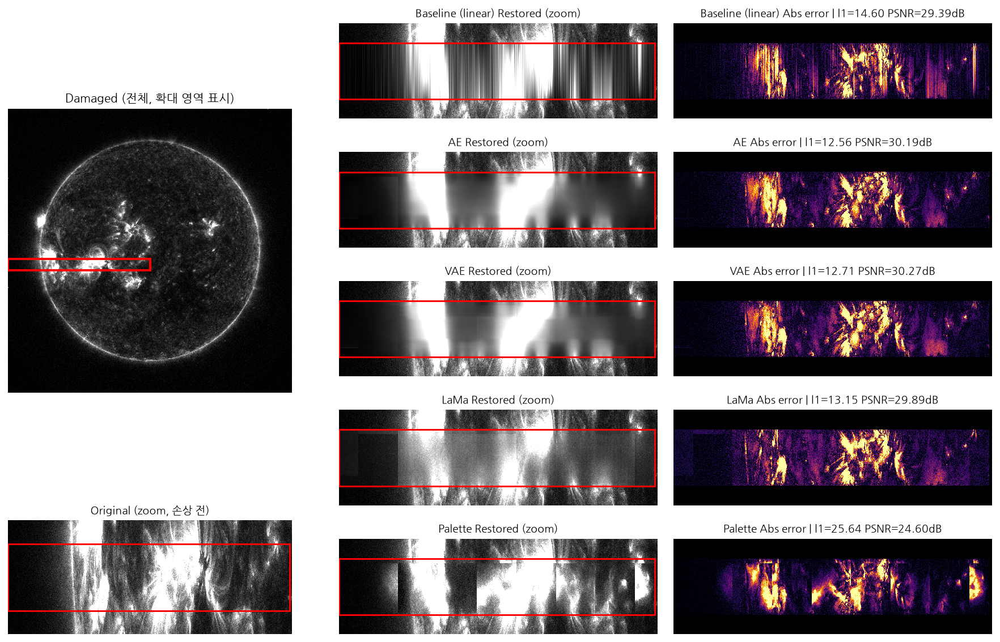

# KASI SDO MISS 영상 복원 (AE / VAE / LaMa / Palette)

한국천문연구원(KASI) 우주탐사기술센터 하계 인턴십에서 진행한 프로젝트입니다.
SDO/AIA 131Å 태양 관측 영상에 발생하는 데이터 손실(MISS) 영역을 딥러닝으로 복원하고,
4가지 방법론(AE, VAE, LaMa, Palette Diffusion)의 성능을 비교 평가했습니다.

## 배경

SDO(Solar Dynamics Observatory) AIA 131Å 채널 영상은 readout channel 오류 등으로
가로 밴드 형태의 데이터 손실(MISS)이 발생합니다. 손상 규모에 따라 MISS0(협소 손상),
MISS1(중간 규모) 등으로 단계를 구분하고, 각 단계별로 복원 성능을 검증했습니다.

## 핵심 발견

픽셀 단위 지표(PSNR, L1)와 실제 시각적 품질이 항상 일치하지 않았습니다.
LaMa는 PSNR/L1 지표상으로는 AE/VAE보다 낮았지만, Fourier Convolution 기반의
넓은 receptive field 덕분에 실제 시각적으로는 더 자연스러운 복원 결과를 보였습니다.
Palette(diffusion)도 마찬가지로 sample_steps를 20에서 200으로 늘렸을 때 픽셀
지표(L1/PSNR)는 큰 변화가 없었지만 SSIM과 시각적 품질(노이즈 speckle 해소)은
뚜렷하게 개선되어, 픽셀 지표와 지각 품질이 별개 축임을 다시 한번 확인했습니다.

| 모델 | masked_l1 | masked_rmse | masked_psnr(dB) | masked_ssim |
|---|---|---|---|---|
| Baseline (linear) | 3.91 | 6.80 | 47.08 | 0.8527 |
| AE | 3.82 | 7.13 | 47.32 | 0.8747 |
| VAE | 3.90 | 7.16 | 47.36 | 0.8757 |
| LaMa | 5.73 | 9.49 | 44.69 | 0.8424 |
| Palette | 9.70 | 17.43 | 39.98 | 0.7469 |

*(MISS1 기준, 픽셀 지표는 AE/VAE가 우세하나 시각 품질은 LaMa와 Palette(sample_steps=200)가
더 자연스러움)*

\* Palette는 diffusion sample_steps=200, core_crop 병합, 200장 평가 기준입니다
(fallback_px=10,204,292로 AE/VAE/LaMa와 동일 조건 확보).

## 복원 결과 비교

## 사용 모델

- **AE**: 4-level encoder + dilated bottleneck convolution 기반 오토인코더
- **VAE**: AE와 동일 구조에 확률적 잠재변수 추가
- **LaMa**: Fast Fourier Convolution 기반 GAN, 넓은 receptive field로 대형 손상에 강점
- **Palette**: Conditional Diffusion Model 기반 inpainting (DDPM 계열)

## 저장소 구조

    sun_miss0_recov/          # 협소 손상(MISS0) 파이프라인
    sun_miss1_recov/          # 중간 규모 손상(MISS1) 파이프라인
    ├── ae/ vae/ lama/ palette/   # 모델별 학습·평가 스크립트
    ├── baseline/              # 선형/3차 보간 baseline
    ├── mask_bank/             # 손상 위치 탐지 + 타일 병합 공용 모듈
    ├── make_comparison_missX.py  # 방법별 비교 이미지 생성
    └── verify_out/comparison_missX/  # 대표 복원 결과 이미지

## 기술 스택

Python, PyTorch, NumPy, Pandas, scipy.ndimage, matplotlib, astropy (FITS 처리)

## 참고

원본 학습 데이터(SDO FITS 파일)와 서버 경로는 보안상 제외되었으며,
경로 관련 상수는 `/path/to/...` 형태의 플레이스홀더로 대체되어 있습니다.
